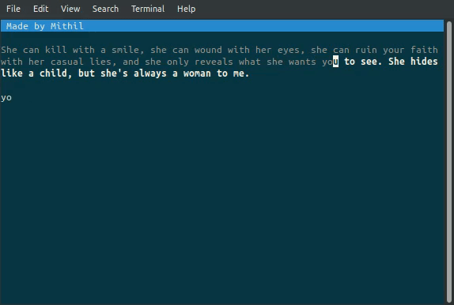

**********
⌨ Mitype ⌨
**********

|Climate| |PyPI Latest Release| |License| |Black|

.. |Generic badge| image:: https://img.shields.io/badge/Author-Mithil-BLUE.svg
    :target: https://www.github.com/mithil467/   

.. |forthebadge made-with-python| image:: https://ForTheBadge.com/images/badges/made-with-python.svg
    :target: https://www.python.org/

.. |PyPI Latest Release| image:: https://img.shields.io/pypi/v/mitype.svg
    :target: https://pypi.org/project/mitype/

.. |Package Status| image:: https://img.shields.io/pypi/status/mitype.svg
    :target: https://pypi.org/project/mitype/

.. |License| image:: https://img.shields.io/pypi/l/mitype.svg
    :target: LICENSE.txt

.. |PyPI pyversions| image:: https://img.shields.io/pypi/pyversions/mitype.svg
   :target: https://pypi.python.org/pypi/mitype/

.. |Make-a-PR| image:: https://img.shields.io/badge/PRs-welcome-brightgreen.svg?style=flat-square
   :target: https://github.com/Mithil467/mitype/pulls

.. |Black| image:: https://img.shields.io/badge/code%20style-black-000000.svg
    :target: https://github.com/ambv/black

.. |Climate| image:: https://api.codeclimate.com/v1/badges/4d0397d4c7dd3b81a205/maintainability
   :target: https://codeclimate.com/github/Mithil467/mitype/maintainability
   :alt: Maintainability

|Demo|

What is it?
===========

**Mitype** is a Python package to test (and improve) your typing speed in your terminal. Test text is taken from
data.db database which is a collection of 6000 strings taken from typeracerdata.com (I do not own any of the
strings and the text content is not given with my license).

Where to get it?
================

The source code is hosted on GitHub at:
https://github.com/mithil467/mitype

Binary installers for the latest released version are available at:
Get the latest news at `Python package index`_.

.. _Python package index: https://pypi.org/project/mitype/#files

``pip install mitype``

That's all if you are on linux and mac OS.
If you are on windows, you also need windows-curses, which can be installed from pypi:

``pip install windows-curses``

How to run it?
==============

Once installed, you can run it by

``python -m mitype``

You can quit the app anytime by pressing ESC key.

Dependencies
============

For windows only - `windows-curses`_.

.. _windows-curses: https://pypi.org/project/windows-curses

Installation from sources
=========================

To install mitype from source - 

In the `mitype` directory (same one where you found this file after
cloning the git repo), execute:

``python setup.py install``

License
=======

`GPL`_

.. _GPL: license.txt